<div align="center">

<!-- Hero banner -->


<!-- Typing line (fast + lightweight) -->


<!-- Quick nav -->
<a href="#activity-insights">Activity Insights</a> •
<a href="#repo-structure">Repo Structure</a> •
<a href="#approach">Approach</a> •
<a href="#features">Features</a>


<br/>

<!-- Repo telemetry badges -->
<a href="https://github.com/abhinavgitin/LeetCode-GFG-Solutions">
  
</a>
<a href="https://github.com/abhinavgitin?tab=repositories">
  
</a>
<a href="https://github.com/abhinavgitin/LeetCode-GFG-Solutions/network/members">
  
</a>
<a href="https://github.com/abhinavgitin/LeetCode-GFG-Solutions/commits/main">
  
</a>

<a href="https://leetcode.com/u/abhinavpuri/">
  
</a>
<a href="https://codeforces.com/profile/abhinavpuri">
  
</a>
<a href="https://www.geeksforgeeks.org/profile/abhinavpurigfg">
  
</a>

</div>

## Activity Insights

<div align="center">

<!-- Dashboard-style metric cards -->


<br/><br/>

</div>

## Language Breakdown

<div align="center">

<a href="https://github.com/abhinavgitin/LeetCode-GFG-Solutions">
  
</a>
<a href="https://github.com/abhinavgitin/LeetCode-GFG-Solutions">
  
</a>

<br/><br/>

<!-- Quick visual stack -->


</div>

- **Primary:** Java
- **Also used:** C
- **Occasional:** Python / JavaScript (when useful for speed or experiments)

---

## Repo Structure

```text
src/          → one file per problem (Java-first)
Solutions/    → markdown notes (approach + complexity)
scripts/      → scaffolding (new_problem.sh)
templates/    → solution note template
assets/       → diagrams / images for selected notes
```

<details>
<summary><b>Quick Run</b></summary>
<br/>

```powershell
# Compile
javac .\src\SolutionName.java

# Run
java -cp .\src SolutionName
```

</details>

<details>
<summary><b>Scaffold a new problem</b></summary>
<br/>

```bash
cd scripts
./new_problem.sh "Problem Name" java   # or: c | cpp | js
```

</details>

---

## Approach

- **Document > just solving** It's better to document what we do.
- **Step-by-step** thinking, kept for future reference.
- **Future use** Coding is rarely clean; we revisit, copy, and adapt.

---

## Features

- **Structured solutions**: one problem per file, predictable naming (underscores).
- **Documentation-first notes**: approach + complexity captured in `Solutions/`.
- **Multi-language approach**: Java core, C when it fits, scripting when it helps.
- **Automation**: scaffolding script + markdown template for fast, consistent logging.

<!-- Footer capsule -->
<div align="center">
  
</div>
