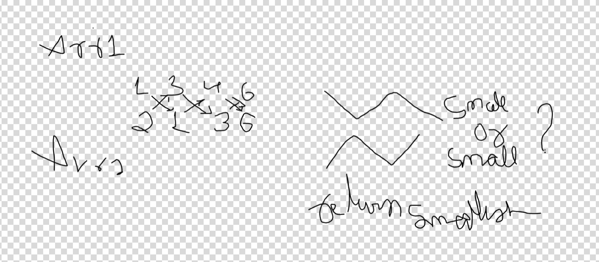

## Code
[View Code Here](../src/AlternatingWithArrays.java)

# Problem:  AlternatingWithArrays
**Platform:** GFG
**Problem link:** 
**Date solved: 2025-11-22**  
**Tags:** <arrays, greedy>

---
## What this shows and what this can be used for!
- **Use case:** Computes the minimum total time to pick elements alternatively from two equal-length arrays, choosing which array to start from to minimize the sum.
- **When to use:** When two parallel sequences represent costs or times and you must pick one element per index alternately from the two sequences.

---
## Intuition
- For each index i, one of the two arrays will contribute to the alternating sum depending on whether we start with array A or array B. There are only two possible alternating patterns for arrays of equal length: start with `arr1` or start with `arr2`. Compute both totals and pick the smaller one.

---
## Approach (step-by-step)s
1. Initialize two accumulators: `startArr1` (sum when starting with `arr1`) and `startArr2` (sum when starting with `arr2`).
2. For each index `i` from `0` to `n-1`:
   - If `i` is even: add `arr1[i]` to `startArr1` and `arr2[i]` to `startArr2`.
   - If `i` is odd: add `arr2[i]` to `startArr1` and `arr1[i]` to `startArr2`.
3. The answer is `min(startArr1, startArr2)`.

---
## Alternate Approaches / Methods
- There is no need for dynamic programming or extra data structures since only two patterns exist; this solution is O(n) and optimal.
- If arrays could be of different lengths or selections had constraints beyond pure alternation, a DP or greedy adaptation may be required.

---
## Complexity
- Time: O(n) — single pass over arrays of length `n`.
- Space: O(1) — only two accumulators are used.

---
## Code
```java
class AlternatingWithArrays {
    public static void main(String[] args) {
        AlternatingWithArrays awa = new AlternatingWithArrays();
        int[] arr1 = {1,3,5,2,4};
        int[] arr2 = {2,1,3,4,5};
        System.out.println( awa.minTime(arr1, arr2) );
    }
    public int minTime(int[] arr1, int[] arr2) {
        // two scenarios: start taking from arr1 or start taking from arr2
        long startArr1 = 0; // start with arr1
        long startArr2 = 0; // start with arr2

        for (int i = 0; i < arr1.length; i++) {
            if (i % 2 == 0) {
                startArr1 += arr1[i];
                startArr2 += arr2[i];
            } else {
                startArr1 += arr2[i];
                startArr2 += arr1[i];
            }
        }
        // return the smaller of the two possible alternating sums
        return (int)Math.min(startArr1, startArr2);
    }
}
```

## Example
- Input: `arr1 = [1,3,5,2,4]`, `arr2 = [2,1,3,4,5]` → Both start patterns produce total `15`, so output `15`.

## Image

